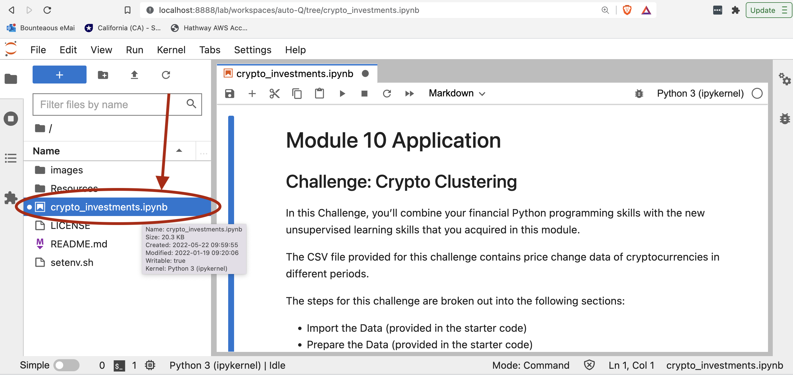

# CryptFolio

A novel crypto currency portfolio tool that leverages unsupervised learning to create superior results.

---

## Technologies

* **Pandas**  - A python library with advanced financial analysis tools.
* **Jupyter Lab** - An IDE used for visualization.
* **anaconda** - A python framework consisting of several tools used in financial analysis, such as Pandas and Jupyter Lab.

---

## Installation Guide
### Prerequisites
* Ensure that Anaconda is installed
* It is recommended that a conda virtual environment is created and used for this analysis
```
conda create -n <environment name> python=3.7 anaconda
conda activate <environment name>
```
**note:** remember to deactivate your environmnent when done with `conda deactivate`

### Start Jupyter Lab
Once your conda virtural environment is started with all prerequisites, start Jupyter Lab:
```
jupyter lab
```

---

## Usage
Once Jupyter Lab has started in your browser, select the **crypto_investments.ipynb** notebook from the **Left Sidebar**.  This is the main analytical notebook.




---

## Contributors

*  **Martin Smith** <span>&nbsp;&nbsp;</span> |
<span>&nbsp;&nbsp;</span> *email:* msmith92663@gmail.com <span>&nbsp;&nbsp;</span>|
<span>&nbsp;&nbsp;</span> [](https://www.linkedin.com/in/smithmartinp/)


---

## License

[](LICENSE)